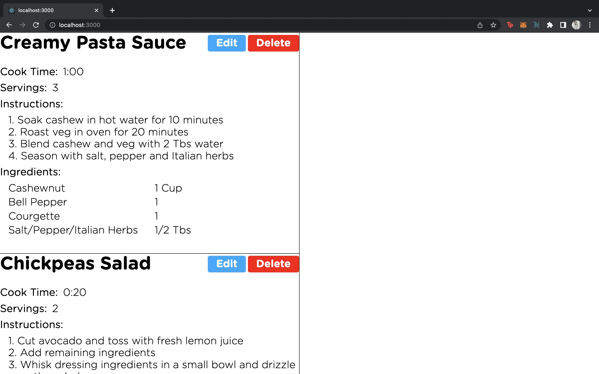
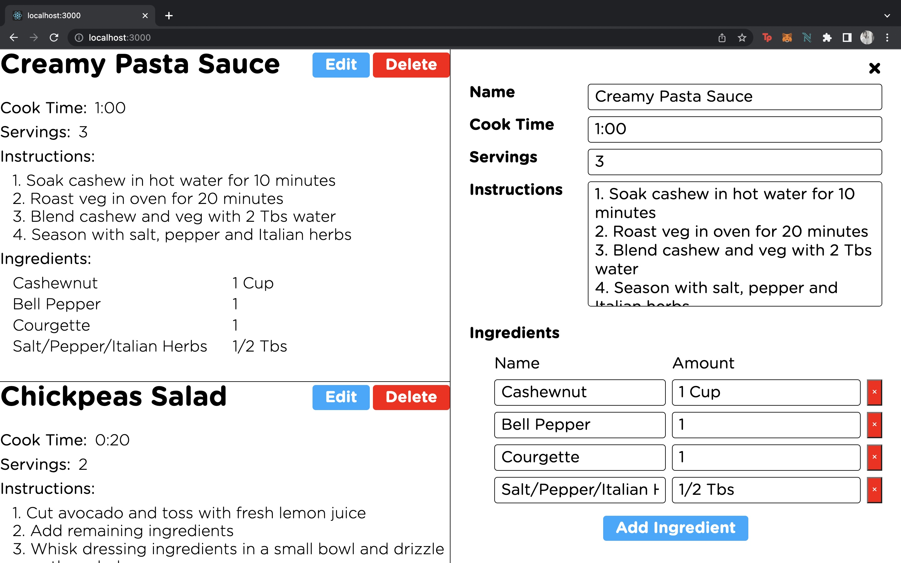

**Project: Recipe Notebook**

This repository contains my first mini React JS application that allows users to edit an existing recipe or add a new recipe to the list. Kindly find attached some notes on the thought process behind component design and best practices.

### Landing Recipe Page


### Edit/Add Button Functions


## Quick Start

These instructions will get you a copy of the project up and running on your local machine for development and testing purposes.

Clone this repository:

```
git clone https://github.com/PraveenLoganathan/React-Recipe-Notebook
```

In the project directory, you can run:

### `npm start`

Runs the app in the development mode.<br>
Open [http://localhost:3000](http://localhost:3000) to view it in the browser.

The page will reload if you make edits.<br>
You will also see any lint errors in the console.

## Upcoming Features

- Enhance user interface, add images to recipes.
- Provide backend functionality.

## Credits

Big shout out to Kyle from https://github.com/WebDevSimplified for creating the Learn React Today course. Your explanation was clear and concise, looking forward to exploring advanced capabilities of React.
